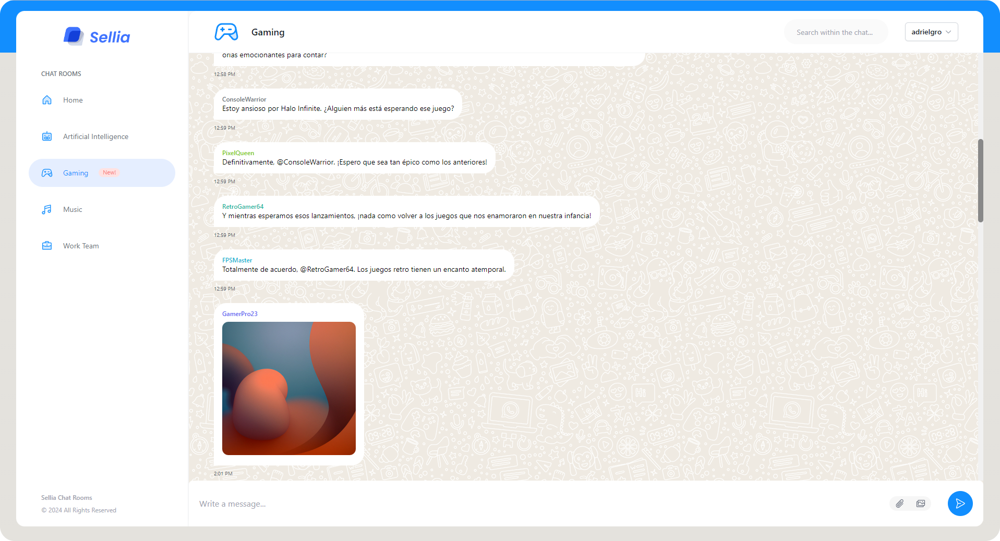

# Real-Time Chat with NodeJS and Vue 3

Welcome to our real-time chat application built with Node.js, Vue 3, GraphQL and TypeORM. This project enables instant communication with GraphQL Subscriptions, utilizing a clean architecture for maintainability and Vuex for state management. It's styled with Tailwind CSS for a sleek and responsive user interface.

## Features

- Real-time chat with GraphQL Subscriptions
- Clean architecture for scalability and maintainability
- Vuex for centralized state management
- Tailwind CSS for responsive styling

## Screenshot


## Running with Docker (Option 1)

1. Make sure you have Docker installed on your machine.

2. Navigate to the `chat-room-node-vue3-ts-graphql` directory, where you'll find the `docker-compose.yml` file.

3. Run the following command to build and start the containers:

   ```bash
   cp .env.docker .env
   ```
   
   ```bash
   docker-compose up -d --build
   ```

4. Once the containers are running, you can access the application:
   - Frontend: http://localhost:4173
   - Backend GraphQL Playground: http://localhost:9000/graphql

## Running Frontend and Backend (Option 2)

First of all, you will need to have MongoDB already installed.

### Running Backend (Node.js)
1. Navigate to the chat/backend directory.
2. Install project dependencies with npm install or yarn install.
3. Configure your database connection in the .env file.
4. Start the Node.js server with the following command:


   ```bash
   cp .env.local .env
   ```

   ```bash
   yarn install
   ```

   ```bash
   yarn dev
   ```
5. The GraphQL server will be available at http://localhost:9000/graphql

### Running Frontend (Vue3)
1. Navigate to the chat/frontend directory.
2. Install project dependencies with npm install or yarn install.
3. Start the development server with the following command:

   ```bash
   yarn install
   ```
   
   ```bash
   yarn dev
   ```
4. Open your browser and access the frontend at http://localhost:4173

## Contributing
We welcome contributions from the community! If you'd like to contribute, please follow our contribution guidelines.

## License
This project is licensed under the MIT License.
